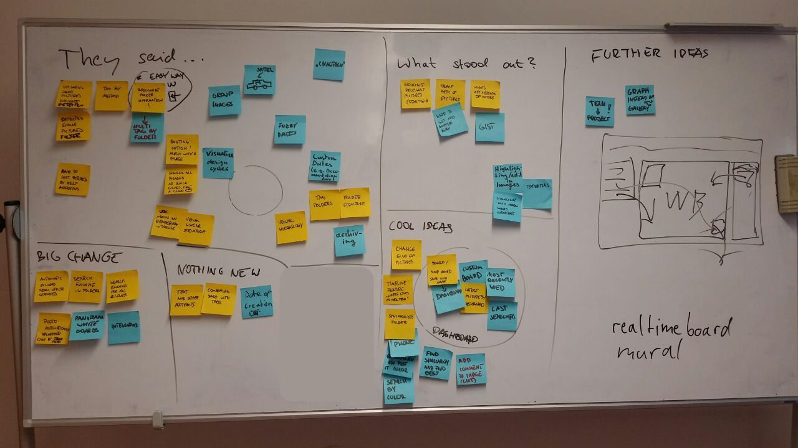

# User Testing Evaluation

## Basic Track Feedback

## Fast Track Booklets

Team Journal 1
> "I was uploading a photo from mobile and could not see the upload button until I flipped my screen to horiztonal and then had to flip back to vertical to do the tagging. I accidentially tapped out of theyboard mode and couldnt tap back into it until I saved and went back to edit. -> PROBLEM FIXED"

> USEFUL IN FUTURE:
> - sort photos in albums
> - scroll through photos in "view file" mode
> - show photo loading

Team Journal 9
> - I was looking for opnening the app - the app is not responsive to my phone screen (iPhone8)
> - I uploaded many pics in on shots, J find tricky to tag all of them
> - The platform does not suggest tags already in use
> - Could've used after prep of interviews Q's instead used whatsapp
> - Team decided to coument end of each day
> - Chrome says it's not secure
> - On Safari & Chrome, the window showing the uploaded images in the upload process is tiny
> - Cannot type "Day 3" due to always using suggestions
> - Pressing delete too many times by accident during uploading old tags
> - no way to remove first tag before removing all others
> - Searching for "First Day" shows images tagges "third day" even as first search results
> - Unnatural having tags on the right when inspecting an image, but on the left when editing it
> - no upload date

Coaches Journal
> We as coaches of team 10 didn't make use of askyour.cloud during the week. The team took control over the coumentation of all whiteboards etc. We heard from then that they really used the platform. It's going to help them to write the documentation after the workshop.

> For us coaches it is still useful. We didn't have a common whatsapp group so we gonna use askyourcloud to upload the pictures we as coaches took - pictures of the team itself etc.

Team Journal
> During Brainstorming phases, way to co-relate with other workshops (intent, #i, content, framwork)

> maybe separated in a timeframe / notebook

> Attach links from web on pictures for relsted topics for idea genertion

> \# work well

> maybe a pool of methods as an inspiration area of the cloud

> maybe the possibility to add gps position on where pictures were taken to easily recover the interview details

> maybe a way to register interviews - like a timetable

> ideation - photo mindmap

## Conclusion

Usability feedback was in the way of valuable feedback (as predicted beforehand). The instructions of the booklet were ignored by the testees. There was not enough time to explain in detail why the booklet should have been used as instructed. Resulting in no feeling of relevance of the instructions. For the future: teams should be instructed in private, with enough time and frequently to ensure both sides understand what they need from each other. The teams should be limited to two of the most motivated ones. If the team is not motivated doing a testing, their results will not be useful and they will be annoyed, too.

For the usability feedback we got a feedback round like with the basic track would have been more fun, productive and valuable.

## Advanced Track User Testing:

Metrics:

- Public Funding: 26
- Virtual Colaboration: 0
- Easy Nursing Care With Sensor Support : 7
- Introducing New Toll Services: 0
- Smooth Car Financing: 7
- Regional Innovation Catalyst: 0
- Economic Attractiveness Of A City: 0
- Knowledge Transfer: 0
- Cleaning Experience: 0

## Conclusion & Learning

Public Funding was the team that contacted us to use askyour.cloud.
They have by far the most images yet and seem the most motiviated.
Having the caveats of the last testing in mind we want to work closely together with this team to gather more feedback. We installed a search query log so we are not dependent on any log journal feedback anymore.
