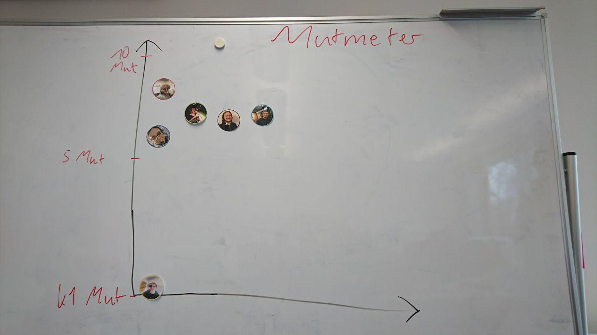
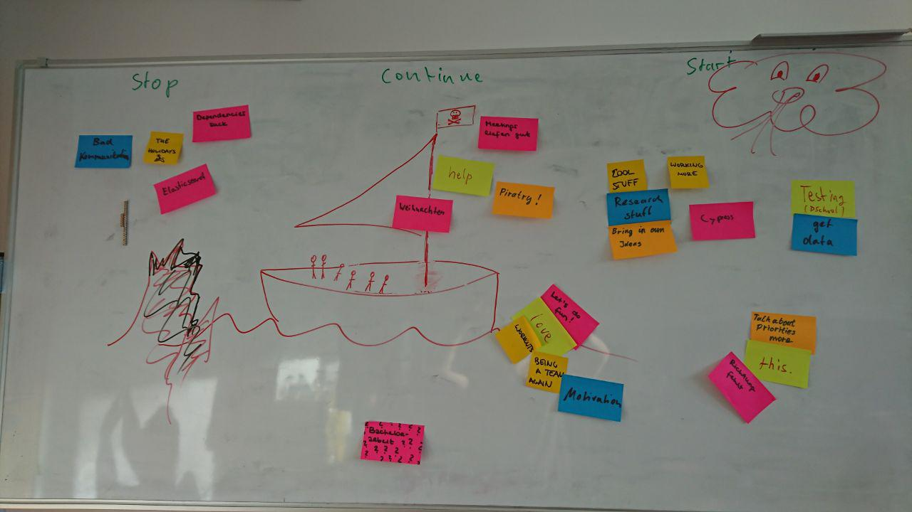

# Protocol

1. Points from last meeting:
* Elija is still not completely understood. -> mostly done
* Don't let Arne do everything with Dialogflow -> done
* SEND LUISE YOUR PICTURES! -> done
* Keep tally of everyones Mate consumption -> done
* Architecture and API overhead -> done
* Problems with Task stealing -> done
* Grades mess with the process -> done
* Standups not being attended by everyone -> done
* Meeting overhead/Long meetings -> solution in place, we will see how well it works

2. Mutmeter (5min)

3. Stop Start Continue (25min)

Action Points:

* Luise to work more on Elija and Tobito
* Motivation and Teambuilding
* Get Chris to do a Bachelor Thesis Workshop with us
* Focus more on cool, exiting, research relevant stuff
* Talk more about priorities in order to make them clear
* Communicate more in critical situations
* Get rid of interpersonal dependencies in tasks
* work more / more office time

Tech/Task related Action Points:
* Reduce relevance of Elasticsearch
* Cypress testing
* Dschool testing
