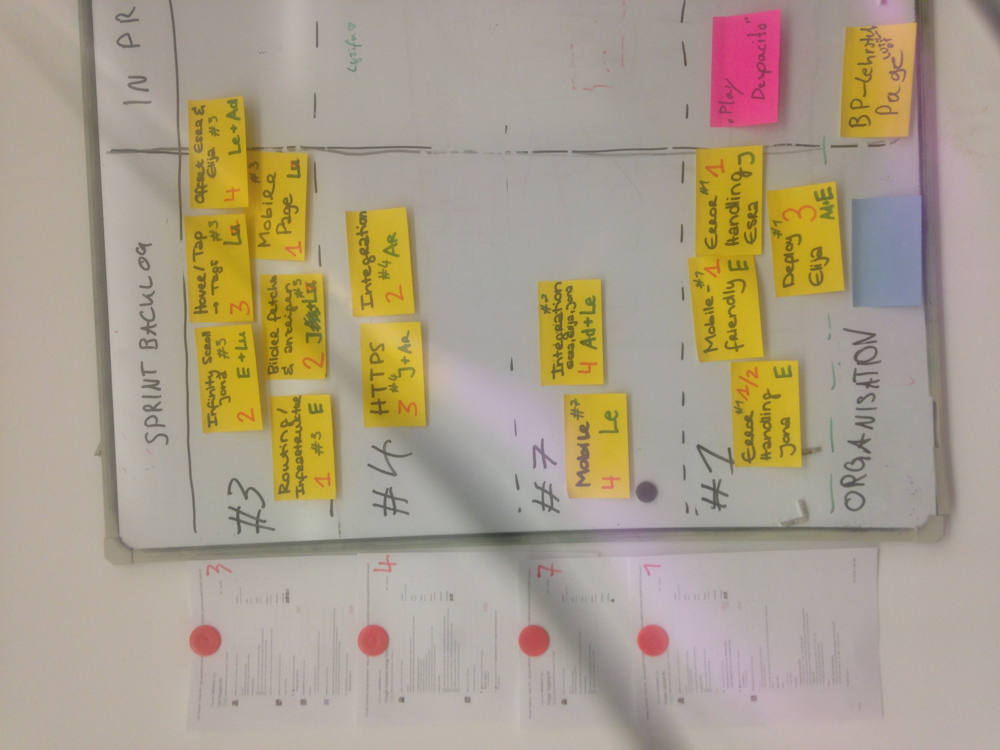

## Protocol

1. Presentation of User Stories
Presented User Stories:
 * [ Search for artifacts by their author in Google Assistant #8 ](https://github.com/hpi-sam/BP2018HG1/issues/8) - Not in this iteration
* [ List Images #3 ](https://github.com/hpi-sam/BP2018HG1/issues/3) - This Sprint
* [ Google Assistant Image Retrieval #4 ](https://github.com/hpi-sam/BP2018HG1/issues/4) - This Sprint
* [ Tag Suggestions #5 ](https://github.com/hpi-sam/BP2018HG1/issues/5) *- Team says doesn't meet 'Definition of Ready'*
* [ Search for artifacts by date #6 ](https://github.com/hpi-sam/BP2018HG1/issues/6) - Not in this iteration
* [ Image Tagging #7 ](https://github.com/hpi-sam/BP2018HG1/issues/7) - This Sprint
* [ Image Upload #1 ](https://github.com/hpi-sam/BP2018HG1/issues/1) - This Sprint
2. Estimation of User Stories
See estimations in [Issues](https://github.com/hpi-sam/BP2018HG1/issues)
3. Chose Iteration goal:  
'Provide a valuable minimal viable product for cataloging D-School pictures'

4. Select User stories based on this goal:
* [ List Images #3 ](https://github.com/hpi-sam/BP2018HG1/issues/3)
* [ Google Assistant Image Retrieval #4 ](https://github.com/hpi-sam/BP2018HG1/issues/4)
* [ Image Tagging #7 ](https://github.com/hpi-sam/BP2018HG1/issues/7)
* [ Image Upload #1 ](https://github.com/hpi-sam/BP2018HG1/issues/1)
5. Expand into Tasks
6. Estimation and Distribution of Tasks:

