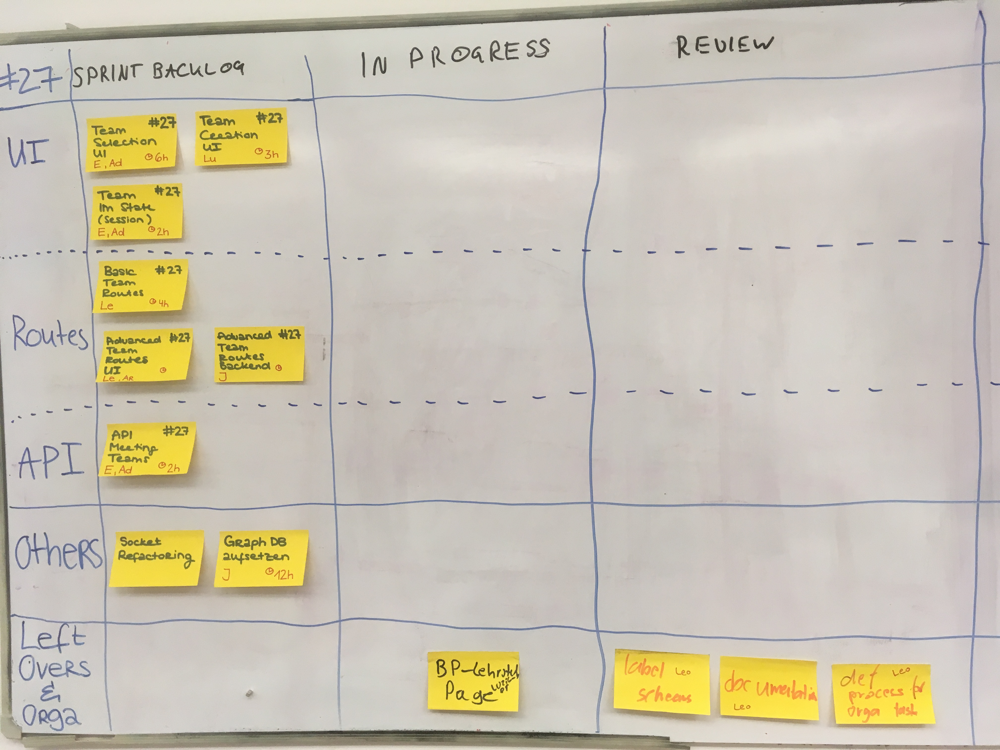

## Agenda

1. Presentation of User Stories (20 min)
2. Estimation of User Stories (20 min)
3. Chose Iteration goal (15 min)
    - print is shorter than usual
4. Select User stories based on this goal (10 min)
    - only one big user story ( #27 )
5. Calculate your personal time for this sprint (1 min):
   * 5 Days (-1 Day for meetings) a 6 Work hours = 24 hours (-PO TASKS, SM TASKS, -DEPLOYMENT TAKSK, -EXAMS, etc.)
6. Expand into Tasks (10 min)
7. Estimation and Distribution of Tasks. (20 min)

Result:

