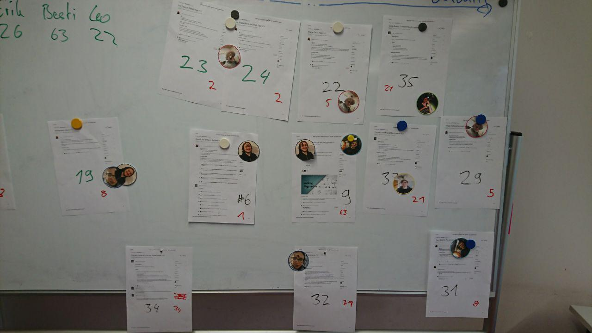

# Protocol

1. Roughly ordering userstories by priority for this Sprint (10min)
2. Assigning userstories to Teammembers

### Results:  

(rough priority list, assignment still in progress)  

(final assignemnt for this Sprint)
