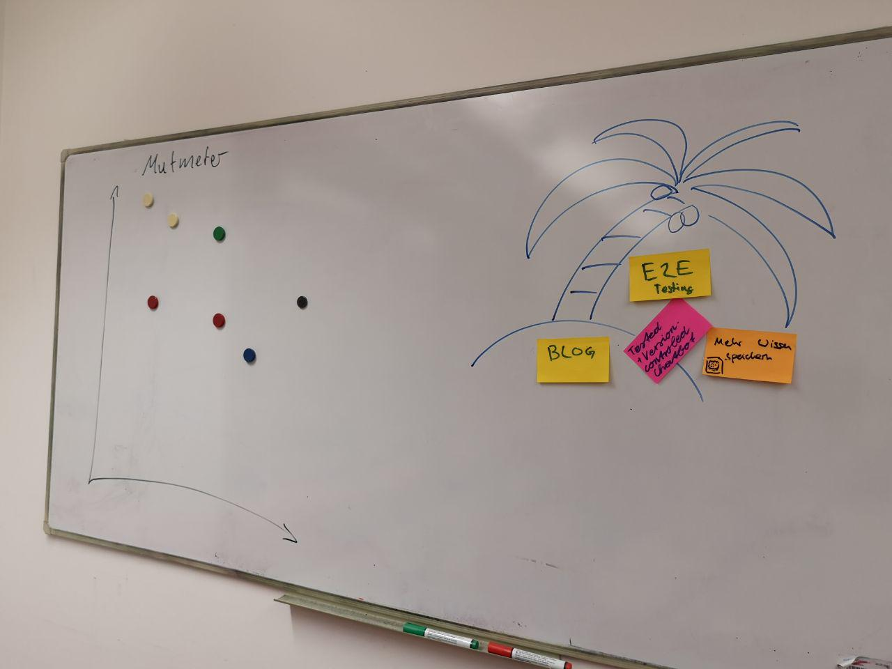
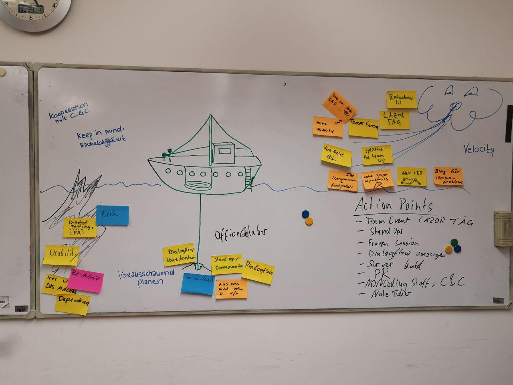

# Protocol

1. Points from last meeting:

  * Luise to work more on Elija and Tobito -> done for elija
  * Motivation and Teambuilding -> lasertag, yay
  * Get Chris to do a Bachelor Thesis Workshop with us
  * Focus more on cool, exiting, research relevant stuff
  * Talk more about priorities in order to make them clear
  * Communicate more in critical situations
  * Get rid of interpersonal dependencies in tasks -> done by assigning userstpries as a whole
  * work more / more office time -> done, better sprint results

  * Reduce relevance of Elasticsearch
  * Cypress testing -> done
  * Dschool testing -> in progress  

2. Mutmeter (5min)

3. Stop Start Continue (25min)

Action Points:

* Get Chris to do a Bachelor Thesis Workshop with us
* Focus more on cool, exiting, research relevant stuff
* Talk more about priorities in order to make them clear
* Communicate more in critical situations
* take care of PR Stuff
* be more reliable when it comes to non-coding tasks (as a team)
* handle questions / chatting in the office in a way that is ok for everyone
* slacking on standups again, lets get that under control

Tech/Task related Action Points:
* care more about Dialogflow
* refactor server cable
* blog
