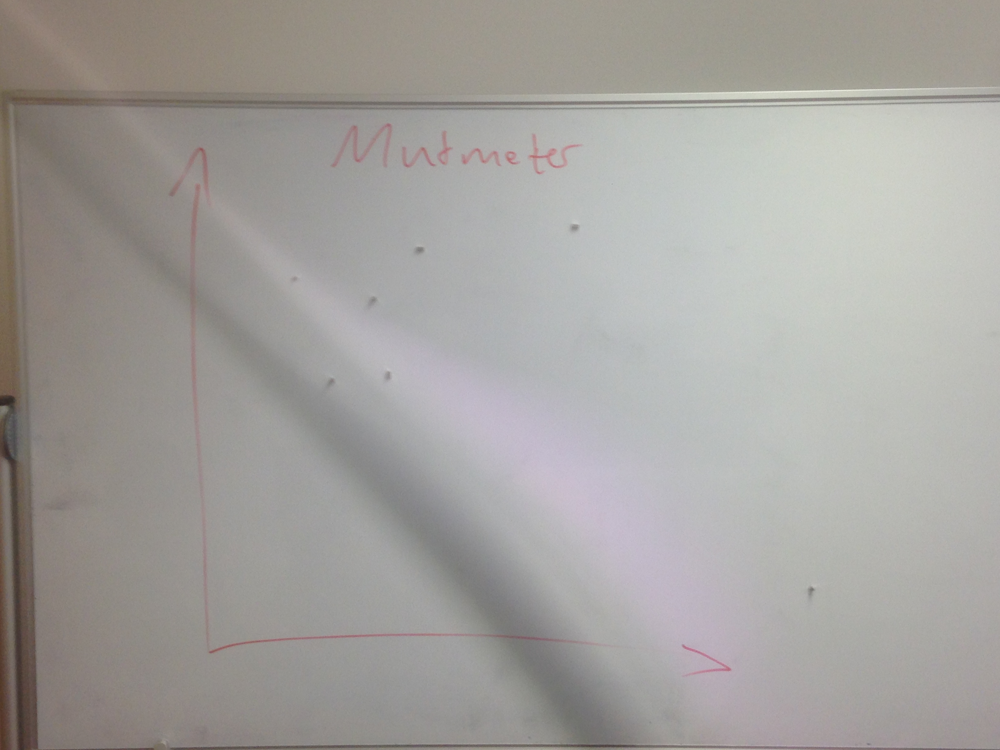

# Protocol

1. Points from last meeting:

* Get Chris to do a Bachelor Thesis Workshop with us
* Focus more on cool, exiting, research relevant stuff -> erik wants more, blog is cool
* Talk more about priorities in order to make them clear -> vision meeting
* Communicate more in critical situations -> need to work on that
* take care of PR Stuff -> we did that so far
* be more reliable when it comes to non-coding tasks (as a team) -> need to work a lot more on that
* handle questions / chatting in the office in a way that is ok for everyone -> headphones rule
* slacking on standups again, lets get that under control -> 

Tech/Task related Action Points:
* care more about Dialogflow
* refactor server cable
* blog

2. Mutmeter (5min)

3. I wish I like (25min)

Action Points:
* punctuality -> 30 min before Review everyone has to be present
* more feedback/attention on slack
* PR's, communication, other tasks are easily forgotten, change that
* love
* motivation, get other stuff out of the way
* more pair programming
* mate bestellen + abrechnung
* postits
* keep the office tidy
