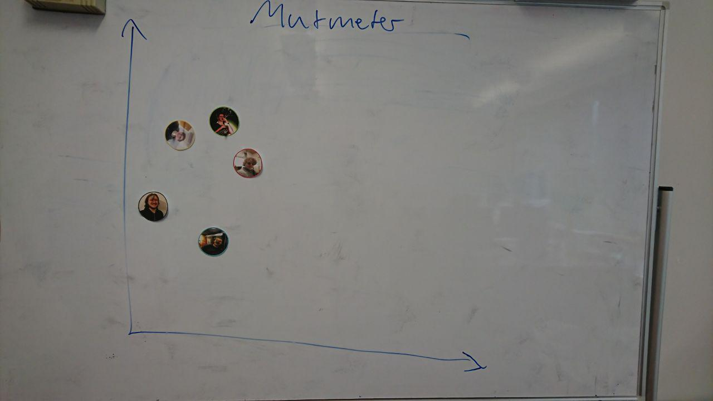
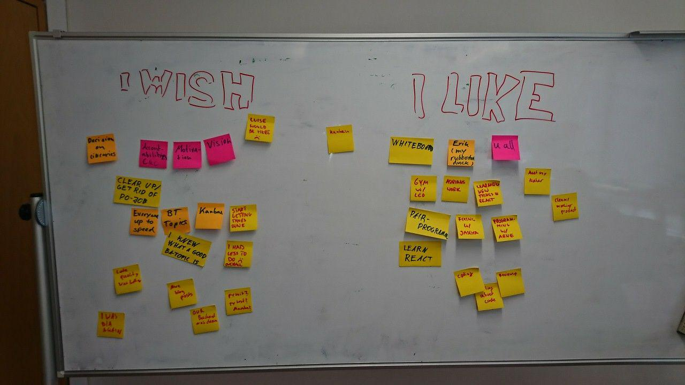

# Protocol

1. Points from last meeting:

* punctuality -> 30 min before Review everyone has to be present
* more feedback/attention on slack
* PR's, communication, other tasks are easily forgotten, change that
* love
* motivation, get other stuff out of the way
* more pair programming
* mate bestellen + abrechnung
* postits
* keep the office tidy

2. Mutmeter (5min)

3. I wish I like (25min)

Action Points:

