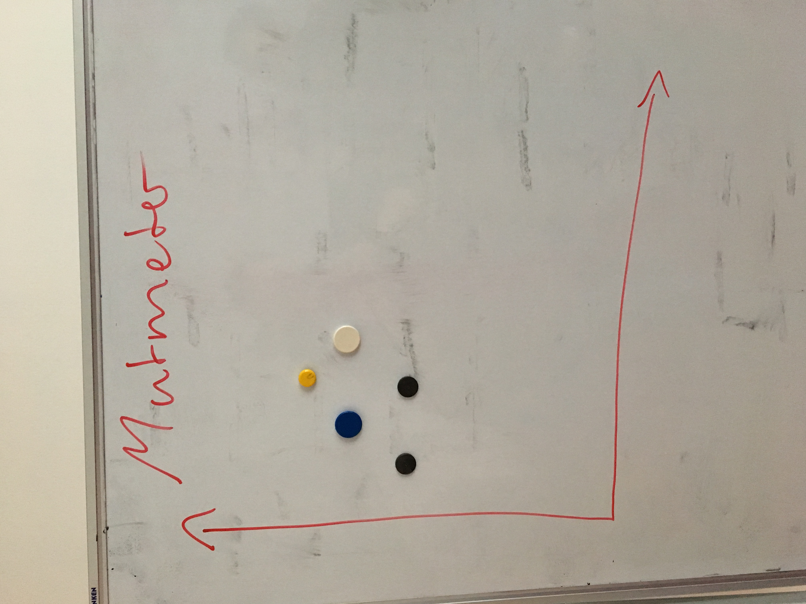
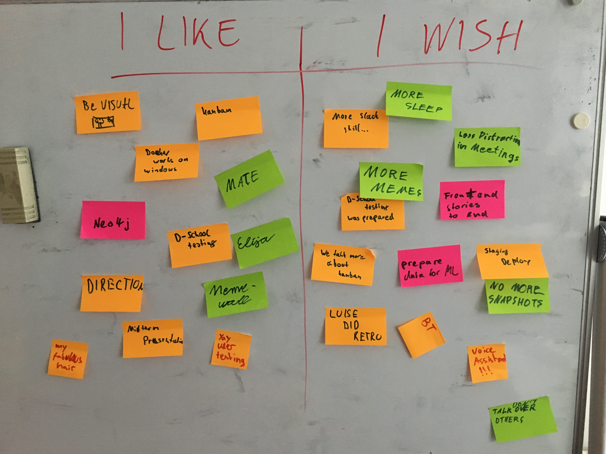

# Protocol

1. Points from last meeting:

* post-its -> yes!
* slack feedback -> still too slow
* motivation, get other stuff out of the way -> better for arne, jascha, leo
* mate bestellen + abrechnung -> bestellt ja, abrechnung nein
* keep the office tidy -> fail, erik and luzifa have been naughty
* document changes in PRs ->  not realized so far
* BT topics -> partially
* vision meeting -> done
* be more accountable c&c -> good so far, coffee machine cleaning needs to be done more often
* kanban no more planning -> done
* architecture -> voice assistant with elija unclear
* finish US's early -> meh
* maybe enforce pair programming -> maybe

2. Mutmeter (5min)

3. I wish I like (25min)

Action Points:

* phrase action items more clearly
* clear architecture for voice assistant communication with elija (postponed)
* merge freeze
* maybe enforce pair programming (postponed)
* data for ML (postponed)
* less distractions in meetings
* staging deployment
* only one person talking at a time
* plan usertesting better, long term
