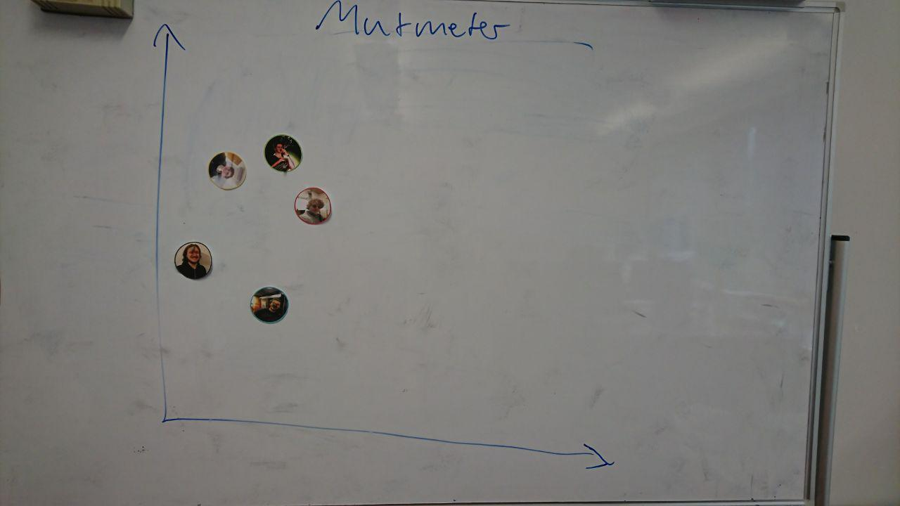

# Protocol

1. Points from last meeting:

* post-its
* slack feedback
* motivation, get other stuff out of the way
* mate bestellen + abrechnung
* keep the office tidy
* document changes in PRs
* BT topics
* vision meeting
* be more accountable c&c
* kanban no more planning
* architecture
* finish US's early
* maybe enforce pair programming

2. Mutmeter (5min)

3. I wish I like (25min)

Action Points:

