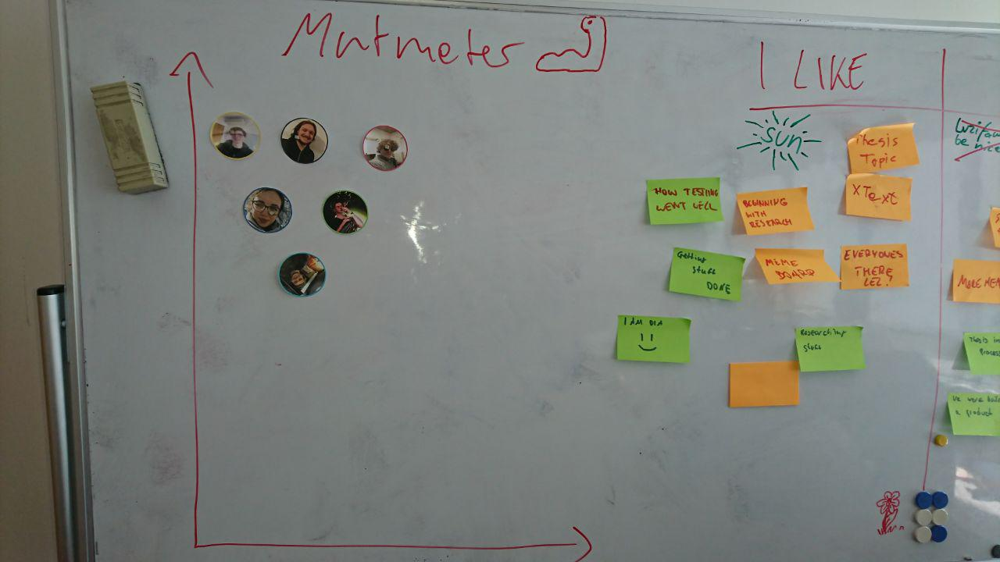
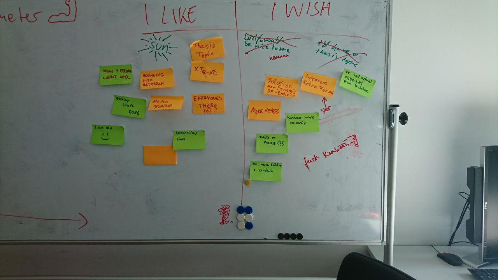

# Protocol

1. Points from last meeting:

* phrase action items more clearly -> will try
* clear architecture for voice assistant communication with elija (postponed)
* merge freeze -> done
* maybe enforce pair programming (postponed)
* data for ML (postponed)
* less distractions in meetings -> slightly better
* staging deployment -> done
* only one person talking at a time -> better
* plan usertesting better, long term -> meeting next week

2. Mutmeter (5min)

3. I wish I like (25min)

Action Points:

* clear architecture for voice assistant communication with elija  
* maybe enforce pair programming (postponed)  
* data for ML  
* try new retro formats
* follow kanban more strictly (enforce limits, keep columns updated)
* retrieve dschool feedback
* add more memes to our memeboard
