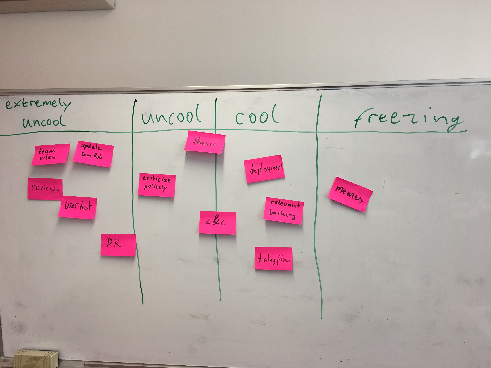

# Protocol

1. Points from last meeting:

* clear architecture for voice assistant communication with elija  -> meh
* maybe enforce pair programming (postponed)  
* data for ML  -> working on it, not much progress
* try new retro formats -> yay
* follow kanban more strictly (enforce limits, keep columns updated) -> meh
* retrieve dschool feedback -> meh
* add more memes to our memeboard -> yay

2. Wall of Coolness (15min)

Action Points:

* retrieve dschool feedback
* data for ML
* follow kanban more strictly
* request reviews early
* take time to review
* include ppl with little domain knowledge in review
* Podium title discussion
* got to dschool in person (for user testing)

